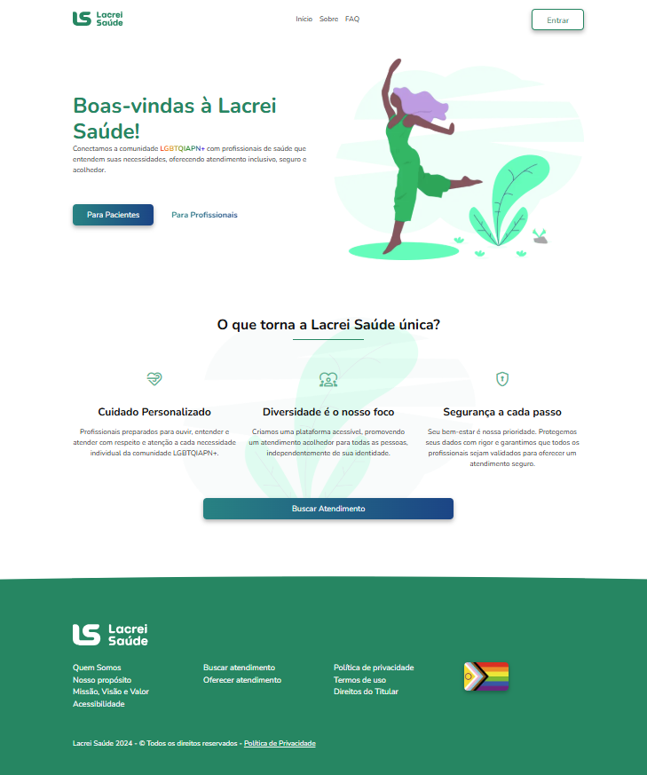

# Desafio Lacrei Saúde

Este é um repositório criado para o desafio de front-end do projeto Lacrei Saúde. O projeto é um monorepo contendo três pacotes interdependentes que formam a base do design system e a aplicação principal.

# Acesso em Produção

O resultado pode ser acessado em [desafiolacrei.vitorsanches.com](https://desafiolacrei.vitorsanches.com/)



## Estrutura do Repositório

O repositório contém os seguintes pacotes:

1. **@lacrei/marsha-core**: Pacote responsável pela definição dos tokens do design system.
2. **@lacrei/marsha-react**: Pacote que contém os componentes genéricos relacionados ao design system.
3. **@lacrei/ui**: A aplicação principal, escrita em Next.js, localizada na pasta `./lacrei`.

## Pré-requisitos

Certifique-se de ter o [Node.js](https://nodejs.org/) instalado em sua máquina.

### Instalação

1. Clone o repositório:

  ```bash
  git clone https://github.com/vitorxfs/desafio-lacrei-saude.git
  cd desafio-lacrei-saude
  ```

2. Instale as dependências do monorepo usando o [npm](https://www.npmjs.com/):

  ```bash
  npm install
  ```

3. Realize o build da aplicação

  ```bash
  npm run build
  ```

4. Inicie a aplicação

  ```bash
  npm run start
  ```

## Scripts NPM

Abaixo estão os scripts disponíveis para rodar, construir e desenvolver os pacotes.

### Para rodar a aplicação no modo de desenvolvimento

1. Para iniciar o desenvolvimento da aplicação, você pode rodar o seguinte comando:

  ```bash
  npm run dev
  ```

  Dessa forma, o turborepo irá garantir que todos os pacotes se mantenham atualizados durante o desenvolvimento

### Para realizar o build a aplicação

  ```bash
  npm run build
  ```

  Isso irá construir todos os pacotes na ordem: `@lacrei/marsha-core`, `@lacrei/marsha-react`, e por último `@lacrei/ui`.

### Para rodar a aplicação em produção

1. Após ter gerado o build da aplicação, você pode rodar o servidor de produção da aplicação com o seguinte comando:

  ```bash
  npm run start
  ```

  Esse comando vai iniciar a aplicação Next.js a partir do pacote `@lacrei/ui` na versão de produção.
